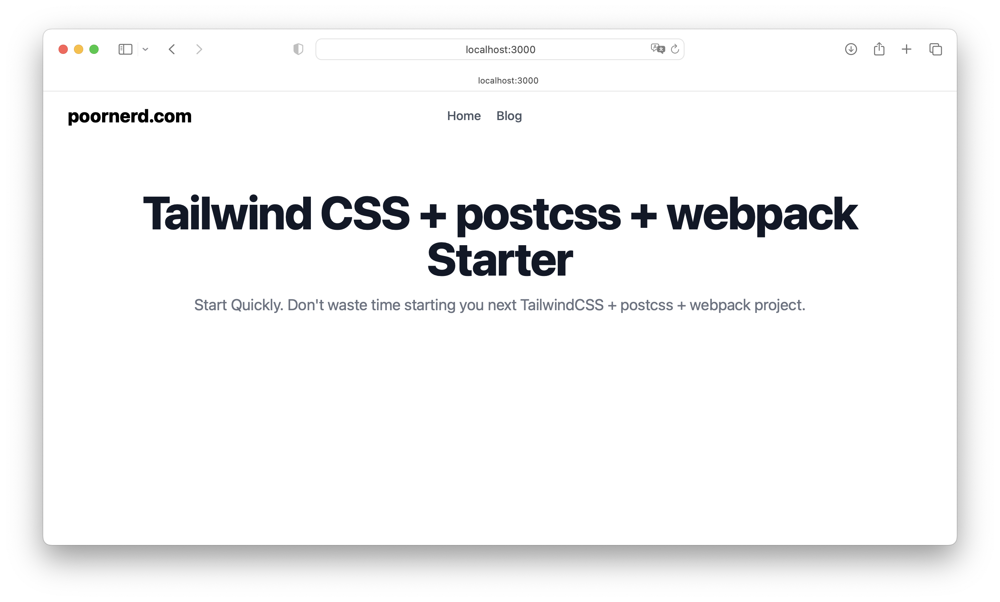

# Tailwind CSS + PostCSS + Webpack Starter Project

This is a starter project for building modern web applications using Tailwind CSS, PostCSS, and Webpack. Tailwind CSS is a highly customizable CSS framework that makes it easy to build complex user interfaces. PostCSS is a tool for transforming CSS with JavaScript plugins, and Webpack is a popular module bundler for JavaScript applications.


## Why a starter project?

A starter project is a great way to jumpstart your development process and get up and running quickly with modern web technologies. This starter project includes all the necessary configuration files and dependencies to start building web applications with Tailwind CSS, PostCSS, and Webpack. You can use this starter project as a starting point for your own web projects, or as a learning resource to understand how to set up and configure these technologies.

## Why Tailwind CSS, PostCSS, and Webpack?

Tailwind CSS is a highly customizable CSS framework that allows you to easily build complex user interfaces without writing custom CSS. Tailwind CSS provides a wide range of pre-designed styles and utilities that you can use to quickly build responsive and accessible user interfaces. PostCSS is a tool for transforming CSS with JavaScript plugins, which allows you to write modern CSS syntax and take advantage of new CSS features while ensuring cross-browser compatibility. Webpack is a powerful module bundler that allows you to easily manage your project dependencies, build your project for production, and run a development server to test your application locally.

## Getting started

To use this starter project, you'll need to have Node.js and npm installed on your machine. Once you've installed Node.js and npm, you can follow these steps:

1. Clone the repository to your local machine:
    ```
    git clone https://github.com/poornerd/tailwindcss-postcss-webpack-starter.git
    ```
1. Navigate to the project directory and install the dependencies:
    ```
    cd tailwindcss-postcss-webpack-starter
    npm install
    ```
    This will install all the necessary dependencies listed in the package.json file.
1. Run the build process:
    ```
    npm run build
    ```
    This will run the Webpack build process and generate a bundled output file in the dist directory.
1. Run the development server:
    ```
    npm run dev
    ```
    This will start a local development server that watches for changes in your code and automatically reloads the browser.
    Start building your web application!
    You can now start building your web application using Tailwind CSS, PostCSS, and Webpack. Open your browser and navigate to http://localhost:8080 to see your web application in action.

## License

This starter project is released under the MIT License. Feel free to use it for personal or commercial projects.